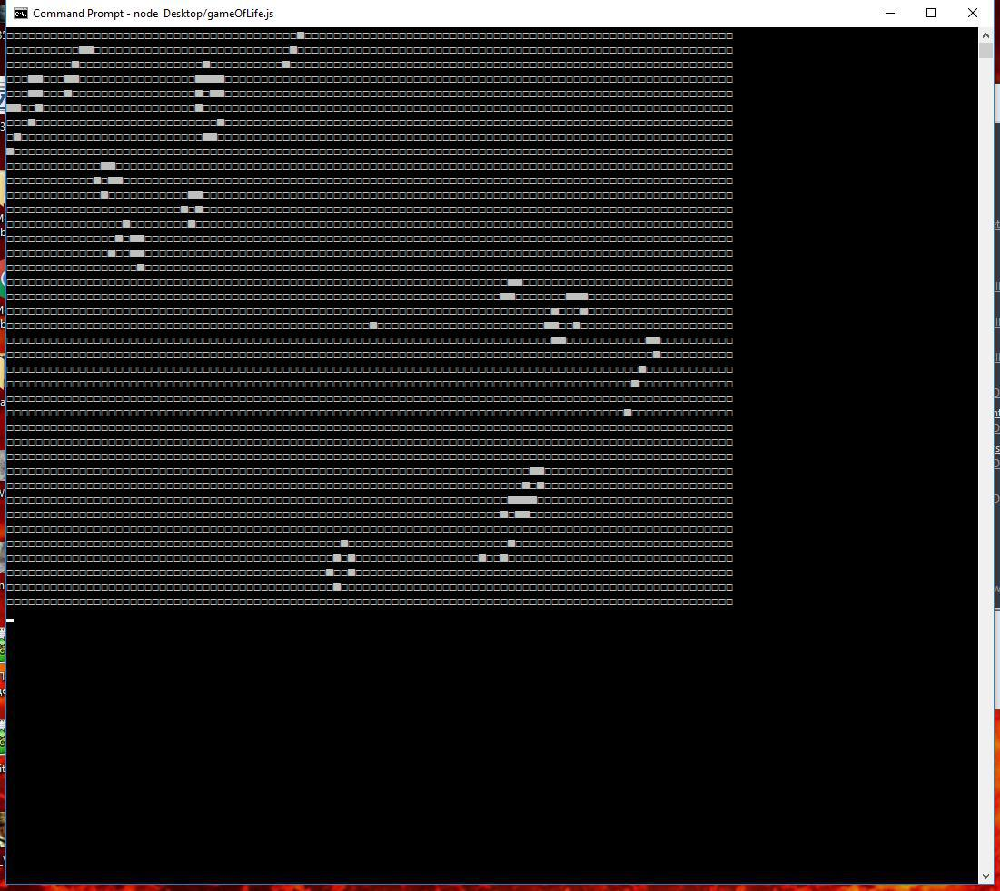

# lab0 (Game of life)

__Instructions:__
1. open terminal/console
2. run script, for example: `node ~path/gameOfLife.js`
3. set start configuration. First number n - number of live cells. Then n pairs (x, y) - coordinates of each cell. Example input: `n x1 y1 x2 y2 x3 y3 x4 y4 x5 y5`. And then we have appropriate points  (x1,y1), (x2,y2), (x3,y3), (x4,y4), (x5,y5). You can use `randomSettings` to make the script do it itself.
4. behold what happens next

